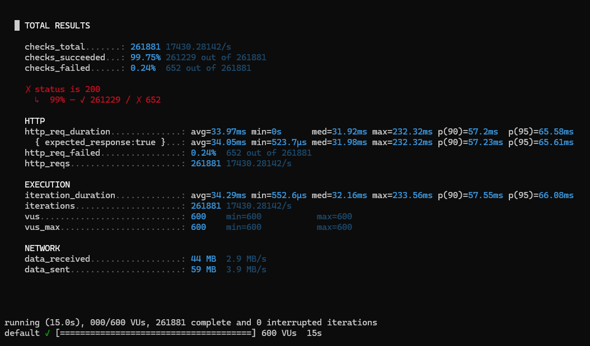

# E-commerce Data Pipeline

## 📌 Overview
This project is a robust, production-grade Data Engineering pipeline designed for an e-commerce platform. It captures user interaction events (views, add-to-cart, purchases) in real-time and processes them using a **Lambda Architecture**. 

The system splits the data into two distinct paths:
1. **Hot Path (Real-time Streaming):** Enriches incoming events and instantly updates a User-Item Interaction Matrix for real-time AI recommendation systems.
2. **Cold Path (Batch Processing):** Efficiently archives raw event data into a Data Lake using columnar storage formats for historical analysis, machine learning model training, and data backup.

## 🛠️ Tech Stack
* **Ingestion API:** Golang
* **Message Broker:** Apache Kafka / Zookeeper
* **Stream Processing:** Python (`confluent-kafka`)
* **In-Memory Cache (Enrichment):** Redis
* **Real-time OLAP Database:** ClickHouse
* **Data Lake (Object Storage):** MinIO (S3 Compatible)
* **Orchestration:** Apache Airflow
* **Data Format:** JSON (Streaming), Apache Parquet (Batch)
* **Infrastructure:** Docker & Docker Compose

## 🚀 System Architecture

### 1. Data Ingestion
* A high-performance Golang API receives raw user events from the frontend/mobile app.
* Events are immediately produced to a Kafka topic (`raw_user_events`).

### 2. Hot Path (Real-time Processing)
* A Python Kafka Consumer subscribes to the topic.
* **Data Enrichment:** The consumer queries Redis to fetch additional item metadata (e.g., category, price) to enrich the raw event.
* **Real-time Aggregation:** Enriched data is pushed to a ClickHouse `MergeTree` table. A ClickHouse `Materialized View` automatically calculates and aggregates implicit feedback (interaction scores) into a `SummingMergeTree` table, creating a clean, real-time `user_item_matrix`.

### 3. Cold Path (Batch / Data Lake)
* Apache Airflow orchestrates a daily batch job (`@daily`).
* An independent Python worker spins up, consumes the exact same events from Kafka using a distinct `group_id`.
* Data is converted from JSON into **Apache Parquet** format using `pandas` and `pyarrow`.
* The heavily compressed Parquet files are uploaded to MinIO under a time-partitioned directory structure (e.g., `year=YYYY/month=MM/day=DD`) for long-term, cost-effective storage.

## ⚙️ Prerequisites
* Docker and Docker Compose
* Python 3.10+
* Git
* Golang (optional, if running the API locally outside of Docker)

## 🏃‍♂️ How to Run the Project

**1. Clone the repository**
```bash
git clone <your-repository-url>
cd DATA_ECOMMERCE
```
** 2. Start the Infrastructure
Spin up Kafka, Redis, ClickHouse, MinIO, and Airflow using Docker Compose:

Bash
cd infrastructure
docker compose up -d
** 3. Verify Services

ClickHouse UI: http://localhost:8123/play

MinIO Console: http://localhost:9001 (Username: admin / Password: password123)

Airflow Web UI: http://localhost:8086 (Username: admin / Password: admin)

** 4. Trigger the Pipelines

Streaming: The Python stream processor runs continuously in the background via Docker.

Batch: Access the Airflow UI, toggle the gom_data_kafka_len_kho_lanh_minio DAG to unpause it, and click the "Trigger DAG" (Play) button to run the manual extraction to MinIO.

📁 Project Structure
Plaintext
.
├── infrastructure/
│   └── docker-compose.yaml     # Infrastructure services setup
├── ingestion/
│   └── main.go                 # Go API to capture events
├── processing/
│   ├── streaming/
│   │   └── streaming_processor.py # Hot path: Kafka -> Redis -> ClickHouse
│   └── batch/
│       └── kafka_to_minio.py      # Cold path: Kafka -> Parquet -> MinIO
└── orchestration/
    └── dags/
        └── daily_batch_pipeline.py # Airflow DAG configuration

## 🚀 Performance & Stress Testing

The system was stress-tested using **k6** to evaluate the maximum throughput and concurrency capabilities of the Golang Ingestion API combined with the Python Stream Processing pipeline.

*Testing Environment: Local execution via Docker Desktop (Windows).*



### 📊 Benchmark Results (600 Virtual Users)

* **Max Throughput:** Peaked at **17,430 Requests/sec (RPS)**. The system successfully ingested and processed over 261,000 events in just 15 seconds.
* **Latency:** The **p(95) response time was 65.61ms**. User experience remains completely unaffected as the API returns a `200 OK` status almost instantly, leveraging an Asynchronous "Fire-and-Forget" pattern.
* **Success Rate:** **99.75%**. 
* **Consumer Lag:** Completely eliminated. This was achieved by scaling the Kafka Topic to **6 Partitions** (enabling parallel I/O) and implementing **Micro-batching** (5,000 events/batch) in the Python consumer.

### 🔍 Bottleneck Analysis

The minimal error rate (0.24% - equivalent to 652 requests) at the 17.4k RPS threshold is *not* a limitation of the Golang source code. This breaking point was identified as a constraint of the local virtualization environment:

1. **TCP Port Exhaustion:** The host Windows OS struggles to allocate and free tens of thousands of TCP sockets per second for Docker Desktop.
2. **Network Bridge Bottleneck:** Docker's internal virtual network bandwidth hits its limit when processing continuous, high-volume micro-payloads.

👉 **Conclusion:** If deployed on a bare-metal Linux server (using Host Network) or a production-grade Kubernetes (K8s) cluster, this Golang API architecture can effortlessly scale to **30,000 - 50,000+ RPS**.